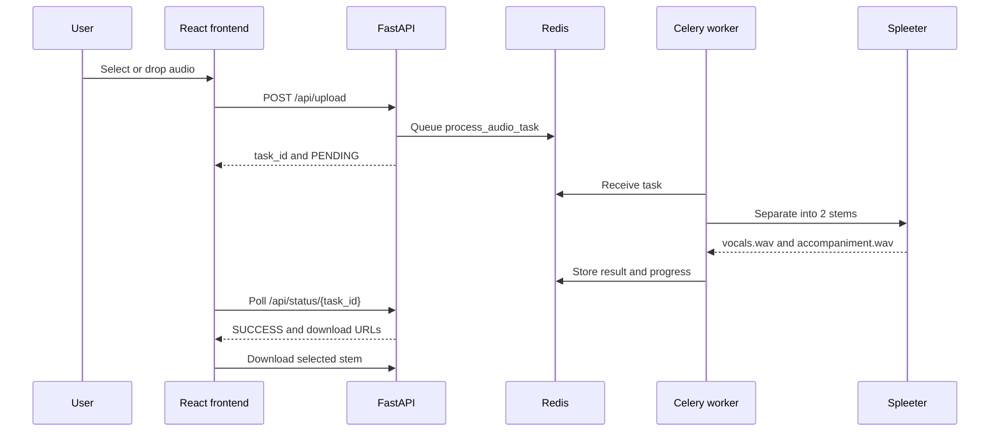

# Vocal Separator

Vocal Separator is a full-stack application that separates vocals from accompaniment in audio files. Upload a track from the web interface and receive downloadable WAV stems through an asynchronous processing pipeline.

## Features

- Drag-and-drop audio uploads
- MP3, WAV, FLAC, OGG, and M4A support
- Spleeter 2-stems vocal/accompaniment separation
- Background jobs with Celery and Redis
- Progress polling with a FastAPI API
- In-browser audio previews and downloads
- React and Tailwind dark interface
- Docker Compose development environment

## Tech stack

- Backend: Python, FastAPI, Celery, Redis, Spleeter, Librosa
- Frontend: React 18, Create React App, Tailwind CSS
- Operations: Docker Compose, Nginx, GitHub Actions

## Prerequisites

- Python 3.9 for the pinned Spleeter/TensorFlow dependency set
- Node.js 18 and npm
- Redis 6+ for local non-Docker development
- FFmpeg and libsndfile for local audio processing
- Docker Desktop for the container workflow

> Spleeter 2.4.0 requires TensorFlow >=2.5 and <2.10. TensorFlow 2.9 has no native Apple Silicon wheel, so macOS arm64 users should use an x86_64 Python under Rosetta or run the Docker setup.

## Installation

```bash
git clone https://github.com/Pro100dexter31/Vocal_remover.git
cd Vocal_remover/vocal-separator

python3 -m venv .venv
source .venv/bin/activate
python -m pip install --upgrade pip
python -m pip install -r backend/requirements.txt

cp backend/.env.example backend/.env
cd frontend
npm install
```

Edit `backend/.env` when Redis or application settings differ from the defaults.

## Run locally

Start Redis in a separate terminal, then start the worker, API, and frontend:

```bash
redis-server

cd ~/Desktop/Vocal_Remover/vocal-separator
source .venv/bin/activate
celery -A backend.tasks worker --loglevel=info

python -m uvicorn backend.main:app --reload --host 0.0.0.0 --port 8000

cd frontend
npm start
```

The web app is available at `http://localhost:3000` and API docs at `http://localhost:8000/docs`.

The helper script automates setup and startup:

```bash
chmod +x run.sh
./run.sh setup
./run.sh run-all
```

Use `./run.sh run-backend`, `run-frontend`, `run-redis`, or `run-celery` for individual services.

## Docker

```bash
cp backend/.env.example backend/.env
docker compose up --build
```

Services:

- Frontend: `http://localhost:3000`
- Backend: `http://localhost:8000`
- Redis: `localhost:6379`

Stop the stack with `docker compose down`. Add `-v` only when you also want to remove Redis persistence.

## Environment variables

| Variable | Default | Purpose |
| --- | --- | --- |
| `REDIS_HOST` | `localhost` | Redis hostname |
| `REDIS_PORT` | `6379` | Redis port |
| `REDIS_DB` | `0` | Redis database number |
| `CELERY_BROKER_URL` | Redis URL | Celery task broker |
| `CELERY_RESULT_BACKEND` | Redis URL | Celery result storage |
| `SPLEETER_MODEL` | `2stems` | Vocal/accompaniment model |
| `AUDIO_BITRATE` | `192k` | Output WAV encoding bitrate |
| `MAX_FILE_SIZE_MB` | `500` | Upload size limit |
| `LOG_LEVEL` | `INFO` | Application logging level |

## API

### Health

```http
GET /api/health
```

```json
{"status":"healthy","service":"vocal-separator"}
```

### Upload

```http
POST /api/upload
Content-Type: multipart/form-data
```

The form field is `file`. The response contains a task ID:

```json
{"task_id":"uuid","status":"PENDING","message":"Audio uploaded and queued for separation"}
```

### Status

```http
GET /api/status/{task_id}
```

The response contains `status`, `progress`, optional output URLs, and an error when processing fails.

### Download

```http
GET /api/download/{task_id}/vocals
GET /api/download/{task_id}/accompaniment
```

Both endpoints return a WAV file as a browser download.

## Upload flow



## Troubleshooting

- `pip` is not found: use `python3 -m pip` or activate `.venv` first.
- TensorFlow has no matching distribution on Apple Silicon: use an x86_64 Python through Rosetta or Docker.
- Redis connection errors: confirm `redis-server` is running or use `docker compose up redis`.
- `ffmpeg` errors: install FFmpeg and `libsndfile`, then retry the worker.
- Frontend cannot reach the API: verify the backend is running on port 8000 and that the frontend proxy is enabled.
- Stale output files: run the Celery cleanup task or remove old directories from `backend/outputs`.

## License

This project is provided for educational and personal use. Add the license terms appropriate for your distribution before publishing a production release.
